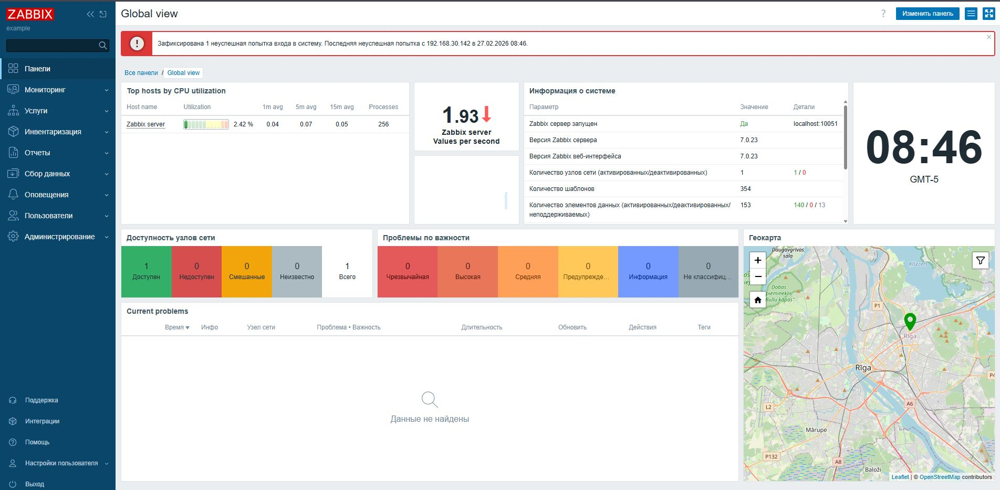
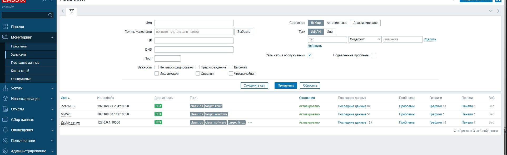
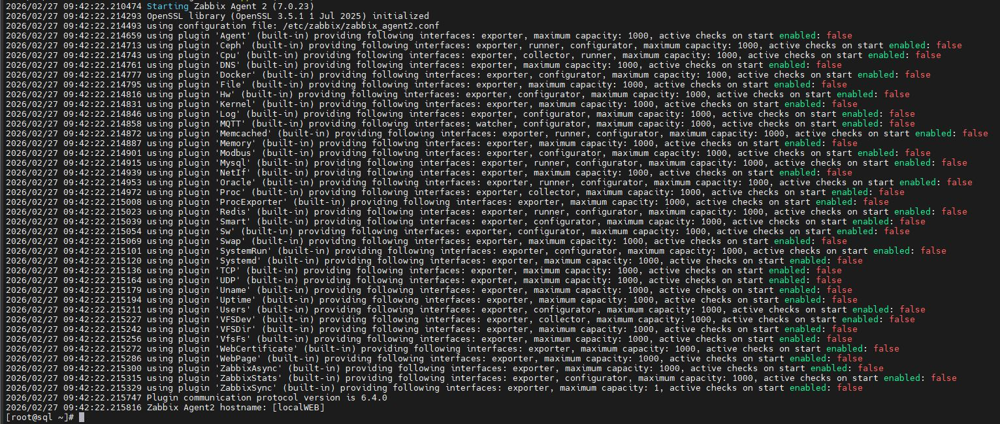
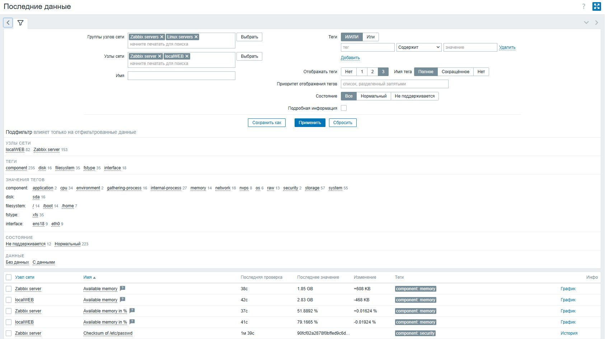
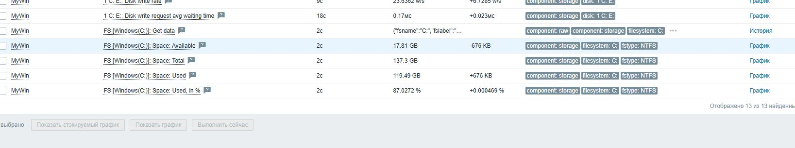

# Домашнее задание к занятию «Система мониторинга Zabbix»


## Задание 1 

Установите Zabbix Server с веб-интерфейсом.

## Процесс выполнения
1. Выполняя ДЗ, сверяйтесь с процессом отражённым в записи лекции.
2. Установите PostgreSQL. Для установки достаточна та версия, что есть в системном репозитороии Debian 11.
3. Пользуясь конфигуратором команд с официального сайта, составьте набор команд для установки последней версии Zabbix с поддержкой PostgreSQL и Apache.
4. Выполните все необходимые команды для установки Zabbix Server и Zabbix Web Server.


### Авторизация


### Список используемы команд

```bash
#отключаем получение пакетов из стандартного репозитория
[epel]
...
excludepkgs=zabbix*

#Добавляем репозиторий Zabbix
rpm -Uvh https://repo.zabbix.com/zabbix/7.0/centos/9/x86_64/zabbix-release-latest-7.0.el9.noarch.rpm
# Очищаем кэш пакетов
dnf clean all
# устанавливаем необходимые пакеты
 dnf install zabbix-server-mysql zabbix-web-mysql zabbix-nginx-conf zabbix-sql-scripts zabbix-selinux-policy zabbix-agent

# Создание базы данных и учетной записи
 mysql -uroot -p
password
mysql> create database zabbix character set utf8mb4 collate utf8mb4_bin;
mysql> create user zabbix@localhost identified by 'password';
mysql> grant all privileges on zabbix.* to zabbix@localhost;
mysql> set global log_bin_trust_function_creators = 1;
mysql> quit;


# Команда для более безопасной работы СУБД
# mysql -uroot -p
password
mysql> set global log_bin_trust_function_creators = 0;
mysql> quit;
# в файле /etc/zabbix/zabbix_server.conf указываем пароль к СУБД ищем строку 
DBPassword=password
# в конфигурации /etc/nginx/conf.d/zabbix.conf снять комментарии у прослушиваемого порта и имени сервера казать свои значения
 listen 8080;
 server_name example.com;

# Перезапуск служб и включение их в автозагрузку
 systemctl restart zabbix-server zabbix-agent nginx php-fpm
 systemctl enable zabbix-server zabbix-agent nginx php-fpm

```

---


## Задание 2 

Установите Zabbix Agent на два хоста.

## Процесс выполнения
1. Выполняя ДЗ, сверяйтесь с процессом отражённым в записи лекции.
2. Установите Zabbix Agent на 2 вирт.машины, одной из них может быть ваш Zabbix Server.
3. Добавьте Zabbix Server в список разрешенных серверов ваших Zabbix Agentов.
4. Добавьте Zabbix Agentов в раздел Configuration > Hosts вашего Zabbix Servera.
5. Проверьте, что в разделе Latest Data начали появляться данные с добавленных агентов.

### Агенты в вебинтерфейсе


### Лог Агента


### Поступаемые данные



### Установка агента
```bash
rpm -Uvh https://repo.zabbix.com/zabbix/7.0/centos/9/x86_64/zabbix-release-latest-7.0.el9.noarch.rpm
dnf update
dnf install zabbix-agent2
firewall-cmd --add-service=zabbix-agent --permanent
firewall-cmd --complete-reload
systemctl enable --now zabbix-agent2.service
```


---
## Задание 3 со звёздочкой*
Установите Zabbix Agent на Windows (компьютер) и подключите его к серверу Zabbix.

### Место на диске C



